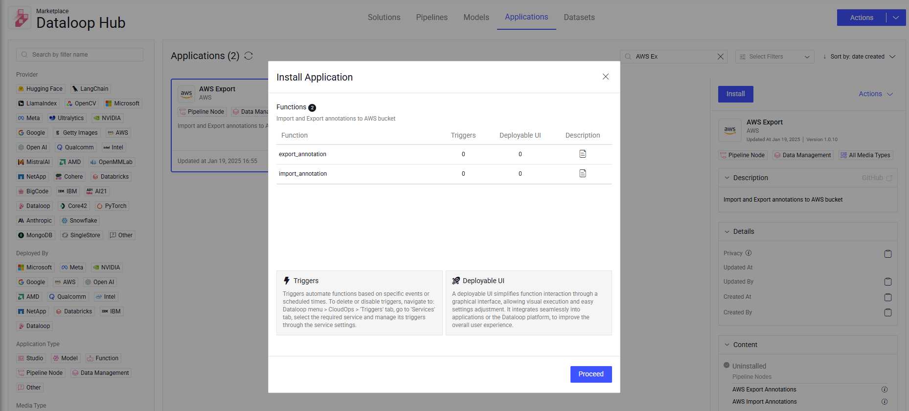
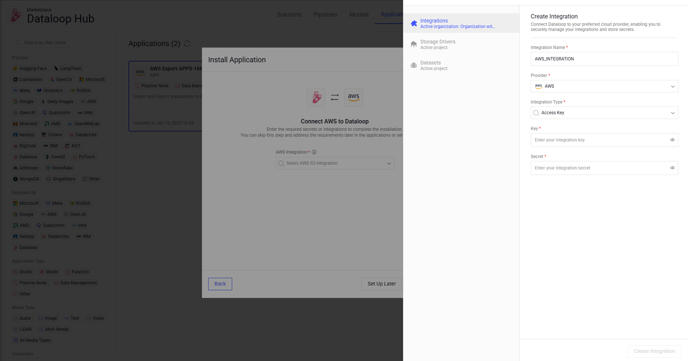
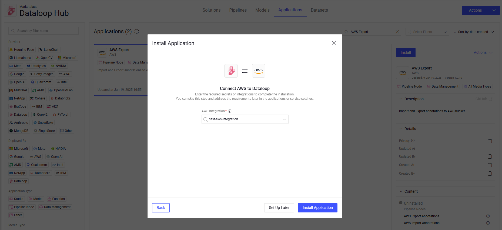
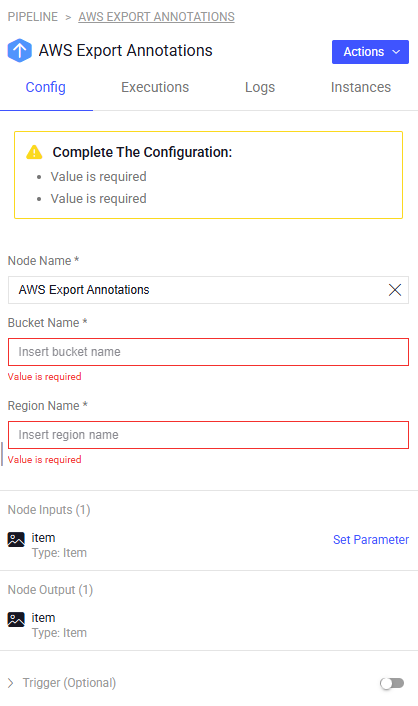

# AWS Hooks

The **AWS Hooks** application has two nodes to Export and Import annotation directly from AWS bucket.


## Quick Start:

1. Go to `Pipelines` and `Create new pipeline`.
2. Build a custom work flow that requires Export/Import annotations to/from AWS bucket
3. Define the bucket name and the region name in the node configuration panel.
4. Start pipeline

Pre-requirements: The AWS-hooks service needs an integration of `AWS_INTEGRATION` that holds the service account json data.  

Also, secret with the following  format can be used as well (put the secrete name in the integration name filed)

```
{
    "key": "your_access_key", 
    "secret": "your_secret_key"
}
```


## Node inputs and Outputs:

Both aws-hooks 2 nodes get the same item as input and output


## How it works:

### Export Annotations to AWS
When an item passes through the node, the node will export the item annotations to a json file and upload it to the AWS bucket. \
The file will be uploaded to the following location: \
`<driver_path>/<item.dir>/<item.name>.json`

### Import Annotations from AWS
When an item passes through the node, the node will download the item JSON annotations file from the AWS bucket and update the item with the new annotations. \
The file will be downloaded from the following location: \
`<driver_path>/<item.dir>/<item.name>.json`


## Setting Up Your AWS Project

To use these nodes, you need an Amazon Web Services (AWS) project. Follow these steps to get started:

1. Create a [S3 Bucket](https://docs.dataloop.ai/docs/aws-access-key-integration#:~:text=integration%20process%20involves%3A-,Step%201.%20Create%20an%20S3%20Bucket,-Log%20in%20to).
2. Create an [IAM Policy](https://docs.dataloop.ai/docs/aws-access-key-integration#:~:text=a%20bucket.-,Step%202.%20Create%20an%20IAM%20Policy,-Log%20in%20to).
3. Create an [IAM User](https://docs.dataloop.ai/docs/aws-access-key-integration#:~:text=IAM%20policies.-,Step%203.%20Create%20an%20IAM%20User,-Log%20in%20to).
4. Create an [Access Key](https://docs.dataloop.ai/docs/aws-access-key-integration#:~:text=for%20more%20information.-,Step%204.%20Create%20an%20Access%20Key%20for%20the%20IAM%20User,-Log%20in%20to).


## Integrating AWS Export & Import API with Dataloop Platform

- Visit the [Dataloop Marketplace](https://docs.dataloop.ai/docs/marketplace), under Applications tab.
- Select the application and click on "Install" and then "Proceed".
  
- Select an existing AWS integration or add a new one by creating an AWS integration with `key` and `secret`.
  
- Install the application.
  


## Node Configuration:



**Configuration**

- **Node Name:** The display name on the canvas.
- **Bucket Name:** The bucket name to export/import the annotations
- **Region Name:** The region name of the bucket


## Contributions, Bugs and Issues - How to Contribute

We welcome anyone to help us improve this app.  
[Here's](CONTRIBUTING.md) a detailed instructions to help you open a bug or ask for a feature request.